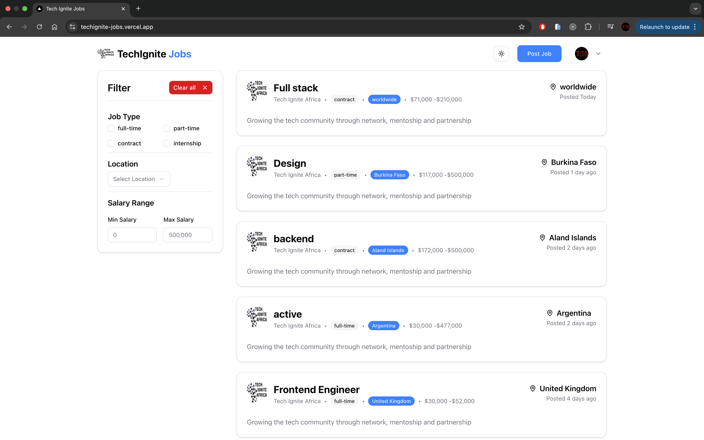
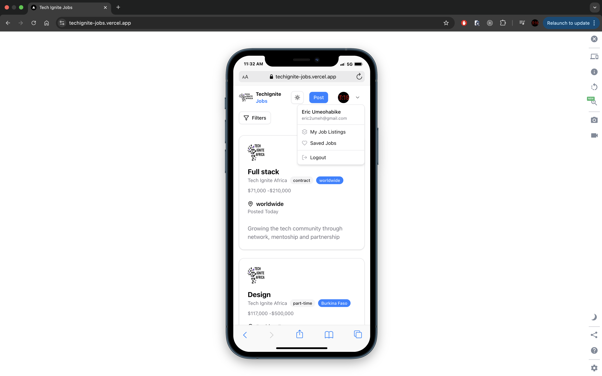

# 🔥 TechIgnite Jobs – Fullstack Job Listing Platform

A modern job board reimagined for the TechIgnite Africa community. Built with a production-ready stack and refined UI, it empowers employers to post jobs and candidates to apply seamlessly. Inspired by Jan Marshal’s original tutorial, this version has been upgraded, customized, and deployed for real-world relevance.

## 🚀 Live Demo

🌐 [Visit Site on Vercel](https://techignite-jobs.vercel.app)  
📦 [GitHub Repository](https://github.com/eric2umeh/techignite-jobs)

---

## 🛠️ Tech Stack

- **Frontend:** Next.js, TypeScript, Tailwind CSS
- **Database:** Neon (Serverless PostgreSQL)
- **ORM:** Prisma
- **Auth:** Auth.js (Google OAuth), Arcjet
- **Payments:** Stripe (for premium job posts)
- **Emails:** Resend (transactional emails)
- **Background Tasks:** Inngest
- **Hosting:** Vercel (Frontend + API Routes)

---

## ✨ Key Features

- 🔐 Google OAuth Sign In / Sign Up (via Auth.js)
- 🧑‍💼 Employer & Candidate Dashboards
- 📤 Post, Edit, Bookmark, and Apply to Jobs
- 💳 Stripe Checkout for Premium Listings
- 📧 Application Confirmation Emails (via Resend)
- ⚡ Rate Limiting with Arcjet
- 🛠 Serverless DB with Neon + Prisma
- 📱 Fully Responsive (Mobile + Tablet)

---

## 💡 Inspiration

"Inspired by Jan Marshal's tutorial from [Jan Marshal's tutorial](https://www.youtube.com/watch?v=lVg7kBhz2KE), this project was rebuilt from the ground up with significant customizations, tailored specifically for the African tech community through the **TechIgnite Africa** initiative. It is now production-ready with real-world integrations and enhanced design."

---

## 🖼️ Screenshots

| Desktop | Mobile |
|--------|--------|
|  |  |

---

## 🛠️ Getting Started Locally

```bash
# 1. Clone the project
git clone https://github.com/eric2umeh/techignite-jobs.git
cd techignite-jobs

# 2. Install dependencies
pnpm install

# 3. Configure environment variables
cp .env

# 4. Run development server
pnpm run dev


## 🌐 Environment Variables
AUTH_SECRET=

AUTH_GITHUB_ID=
AUTH_GITHUB_SECRET=

AUTH_GOOGLE_ID=
AUTH_GOOGLE_SECRET=

DATABASE_URL=

UPLOADTHING_TOKEN=

ARCJET_KEY=

NEXT_PUBLIC_URL=

STRIPE_SECRET_KEYHV6extDeQouJEcLLzs89esL00DLc65EIl=

STRIPE_WEBHOOK_SECRET=

RESEND_API_KEY=

INNGEST_EVENT_KEY1pc5cWD-lXag=

INNGEST_SIGNING_KEY=


## 🧑‍💻 Contributing

Got improvements? Bug fixes? Feature ideas?

```bash
# Fork it
# Create a new branch: git checkout -b feature-name
# Make changes and commit: git commit -m 'Added new feature'
# Push and create a PR

## ⭐ Support
If you find this project helpful, please give it a ⭐ and share it to help fellow developers and job seekers!

## 📫 Contact

**Eric Umeohabike**

- 🌐 [LinkedIn](https://www.linkedin.com/in/eric-umeohabike)
- 📸 [Instagram](https://instagram.com/techigniteaf)
- 💻 [GitHub](https://github.com/eric2umeh)